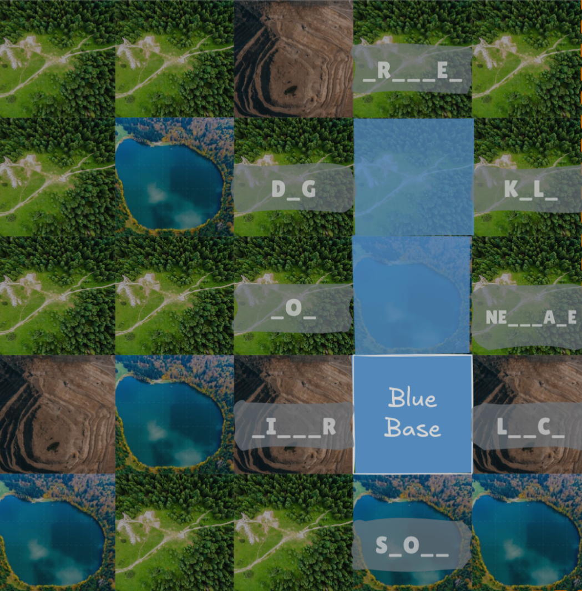
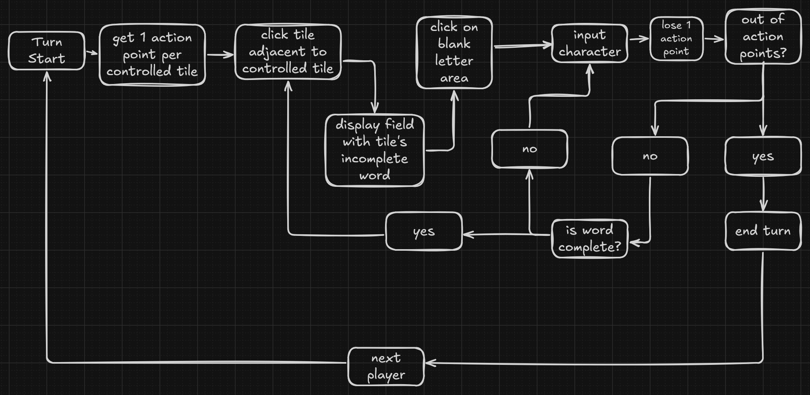

# LexiConquest
_A wordgame project for the '__Test, Integration och Leverans course__'._

*demo picture | not final product* <br/>


## Description
A multiplayer wordgame where you capture tiles by guessing each letter 'hang-man' style 
on a map grid to get stronger and win over your opponents! 

## Game Rules
- __Turn-Based__
  - With a turn timer
- __Capture Tiles__ by guessing the word
  - __Capturing__ can only be done from adjacent tiles that are already controlled


- __Action Points__ for each player, starting with 1
  - One action point per controlled tile!
- __Win__ by any chosen condition:
  - __Total score__
    - Achieve the set score
  - __Objective__
    - Defeat a certain player
    - Control a certain amount of tiles
  - __Domination__
    - Capture every controlled tile of the other players
- __Special Tiles__ can be captured for unique abilities! (planned)
## Turn Flow


## How To Run
### Needs to be installed:
- Nodejs v24.14
1. Clone the project: <br/>``` git clone git@github.com:stuNero/lexicon-conquest.git```
2. Run in terminal:
- ```npm install```
- ```npm run dev```
## Tech Stack
- React + JS
- C#
- xUnit

## To view the game live go to:
[lexicon-conquest.onrender.com](https://lexicon-conquest.onrender.com/)


## Testplan
In this project we use teststrageti that is integrated through out the whole process. Our main focus has been on TDD and BDD development. 
We have used following tests:
unit-test with xUnit
API-test with Post-they
e2e-test with Playwright and Gherkin

All the tests run automatically in our CI-pipeline on every push and pull requests to DEV and main branches. From security viewpoint our pipeline checks for leaked secrets via Gitleaks, NPM Audit, dotnet list package to find any vulnarabilities in dependencies and Trivy to scan the Docker-container for critial risks. 


## CI/CD Pipeline
Our pipeline is implemented in Github Actions and has two workflows that automates the process of testing code changes to live deployment. 

# The first workflow, Testing.yml triggers when someone pushes or does pull request to DEV or main. It consist of three jobs:

Security: does secaurity scans for vulnarabilities and leaks. 
Build: creates the frontend with vite, backend with .NET and validates the Docker file.
Tests: runs a matrix of unit-tests, API-tests and e2e-tests.

We have a multistage Dockerfile that works in this order:
Frontend builds with node.js and vite
Backend builds .NET SDK
The finished forntend files are copied to the backends wwwroot fodler before publishing
Finally a run time image is created with .NET ASP.NET
This ensures that both front and backend are included in the same container.


# The second workflow, Deploy.yml triggers only when the testing-workflow has completed succesfully on the main branch. 

It calls on Render Deploy Hook with a secret URL that is saved in Github Secrets. This initiates an automatic deployment to Render. 
Our production envoirnment is set to Auto-Deploy in Render which means as soon we make changes in our main branch the Render deployment is triggered and we get the new version on the server. 


Pipeline is configured so that all test types runs even if one of them fails. Test results are then uploaded to GitHub Actions pipeline-summary. 


## Contributors:
- Amir Jafari ➡️ https://github.com/amirhamza247
- Ha-Viet Kok ➡️ https://github.com/havietkok-sys
- Oliver Apelquist ➡️ https://github.com/OliverApel96
- Max Vemic ➡️ https://github.com/stuNero
