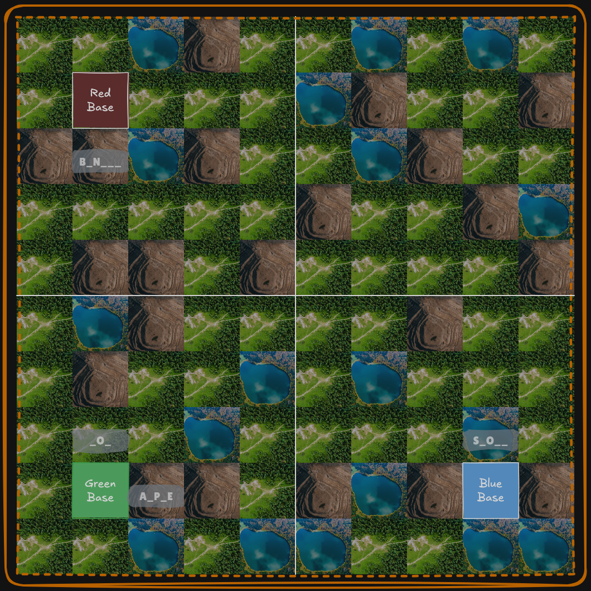

# Lexicon Conquest
_A wordgame project for the '__Test, Integration och Leverans course__'._

## Description
A grid-styled wordgame where you guess the word of a tile to capture it and then conquer the world! 
## Game Rules
- __Turn-Based__
- __Action Points__ for each player, starting with 1
  - One action point per controlled tile!
- __Capture Tiles__ by guessing the word
- __Win__ by any chosen condition:
  - __Total score__
  - __Objective__
    - Defeat a certain player
    - Control a certain amount of tiles
  - __Domination__
- __Special Tiles__ can be captured for unique abilities!

## How To Run
1. Clone the project
2. 
## Tech Stack
- React + JS
- C#
- xUnit
- databas???

## Contributors:
- Amir Jafari ➡️ https://github.com/amirhamza247
- Ha-Viet Kok ➡️ https://github.com/havietkok-sys
- Oliver Apelquist ➡️ https://github.com/OliverApel96
- Max Vemic ➡️ https://github.com/stuNero